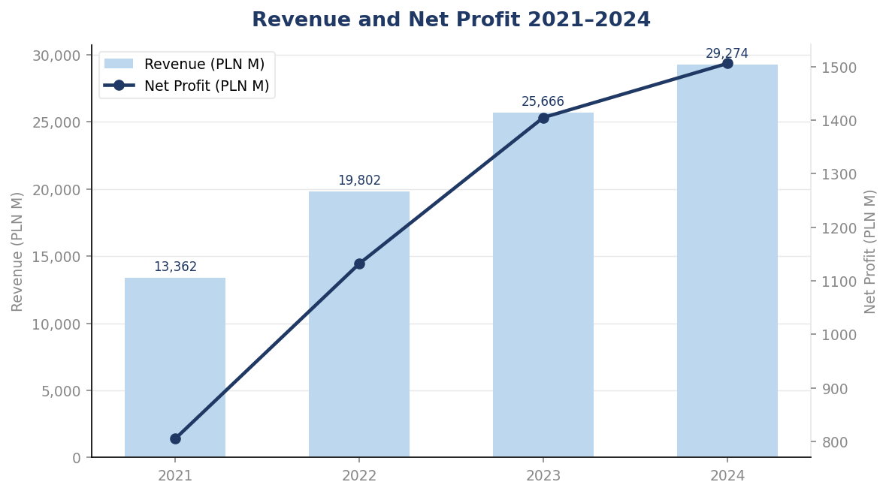
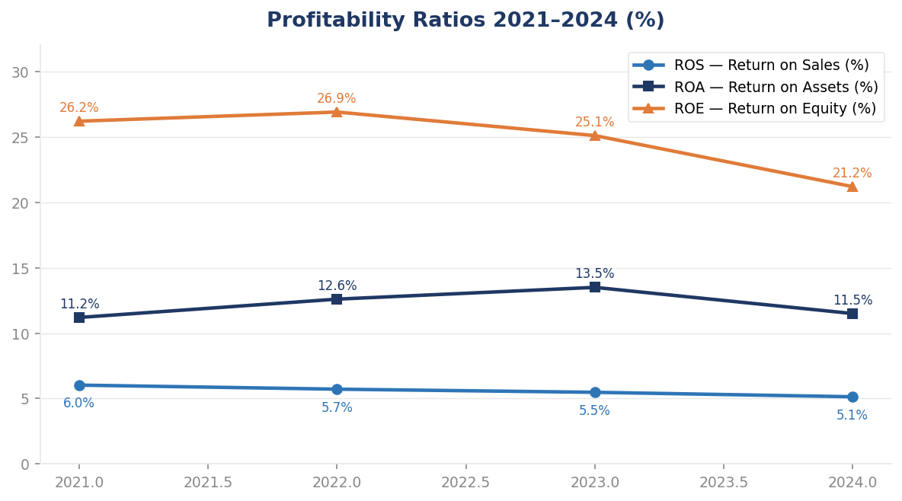
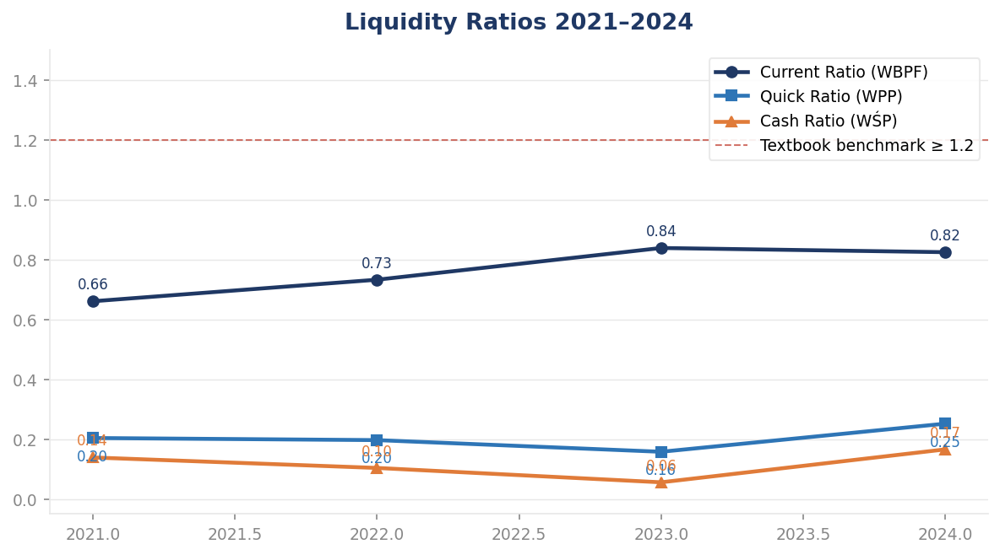
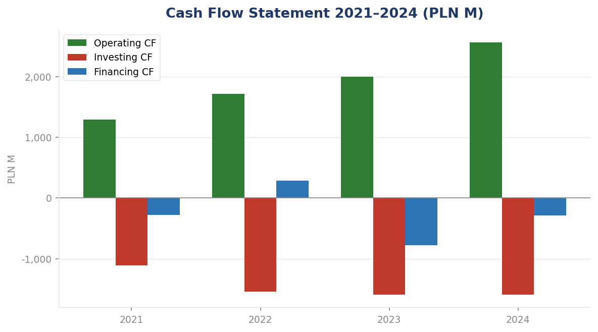
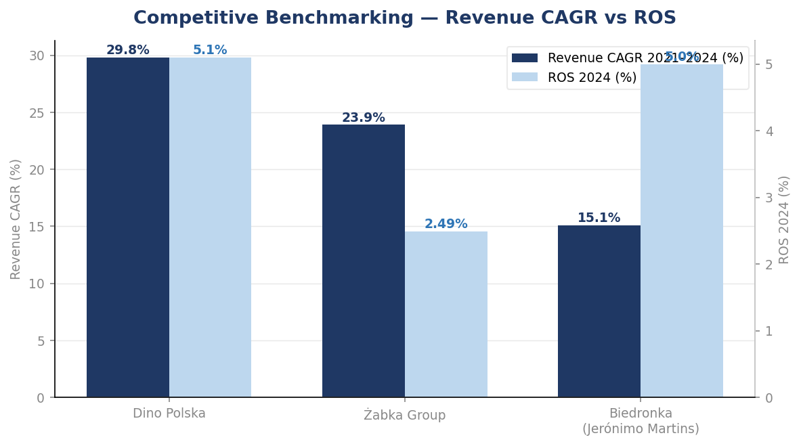
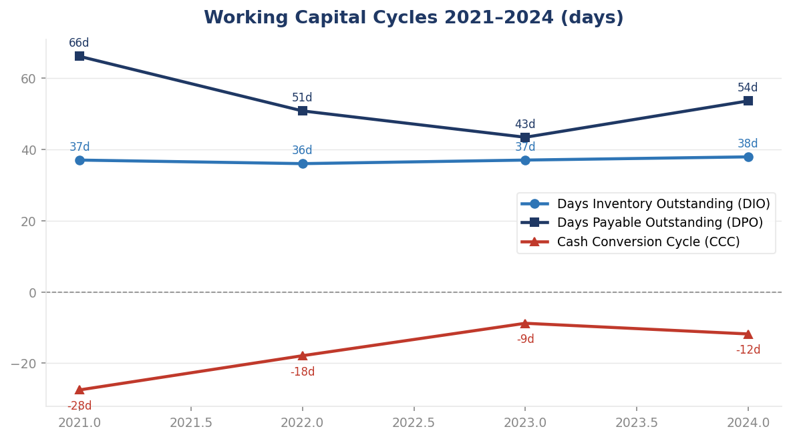

# Dino Polska S.A. — Financial Analysis (2021–2024)

**Junior Financial Analyst Portfolio Project**  
4-year analysis of profitability, liquidity, efficiency, debt structure and cash flows  
of Poland's fastest-growing grocery retailer · Excel · June 2026

---
---



---

## Table of Contents

- [Project Overview](#project-overview)
- [Business Problem](#business-problem)
- [Objectives](#objectives)
- [Methodology](#methodology)
- [Data Sources](#data-sources)
- [Financial Ratios Analyzed](#financial-ratios-analyzed)
- [Key Charts and Visualizations](#key-charts-and-visualizations)
- [Business Insights](#business-insights)
- [Competitive Benchmarking](#competitive-benchmarking)
- [Recommendations](#recommendations)
- [Future Work](#future-work)
- [Project Structure](#project-structure)
- [Tools and Technologies](#tools-and-technologies)
- [About the Author](#about-the-author)

---

## Project Overview

This project is a full-scope financial statement analysis of **Dino Polska S.A.** — one of Poland's fastest-growing mid-size grocery supermarket chains — covering the period **2021 to 2024**.

Dino Polska operates over **2,688 stores** (as of 2024), primarily in small and medium-sized towns across Poland, and is listed on the Warsaw Stock Exchange (GPW: DNP). The company follows an owner-operated model built on vertical integration (own meat processing plant Agro-Rydzyna), proprietary real estate, and a standardized store format of approximately 400 m².

| Area | Scope |
|---|---|
| Statements covered | Balance Sheet · P&L · Cash Flow Statement |
| Analysis methods | Horizontal · Vertical · Ratio · Trend · Benchmark |
| Period | 2021 · 2022 · 2023 · 2024 |
| Currency | Polish Złoty (PLN, thousands) |
| Standard | Polish Accounting Act (Ustawa o Rachunkowości) |

---

## Business Problem

This analysis was designed to answer three executive-level questions:

1. **Is the company financially healthy?** Can it sustain its expansion without compromising financial stability?
2. **What changed — and why?** Which metrics improved, which deteriorated, and what drove those changes?
3. **What should management do next?** What are the key risks and strategic actions?

---

## Objectives

- Perform a complete financial statement analysis for 2021–2024
- Calculate and interpret all major financial ratios (profitability, liquidity, efficiency, debt)
- Conduct horizontal analysis (YoY changes) and vertical analysis (cost structure)
- Benchmark Dino Polska against major competitors (Żabka Group, Biedronka)
- Formulate strategic recommendations supported by the analysis

---

## Methodology

```
Step 1 — Data Collection
        ↓
Step 2 — Data Structuring in Excel (financial model)
        ↓
Step 3 — Horizontal Analysis (YoY changes)
        ↓
Step 4 — Vertical Analysis (structure as % of total)
        ↓
Step 5 — Financial Ratio Calculation (20+ indicators)
        ↓
Step 6 — Trend Analysis (4-year trajectory)
        ↓
Step 7 — Competitive Benchmarking
        ↓
Step 8 — Business Interpretation
        ↓
Step 9 — Risk Assessment and Strategic Recommendations
```

---

## Data Sources

| Source | Description |
|---|---|
| Dino Polska S.A. Annual Reports (2021–2024) | Primary data — standalone financial statements |
| Żabka Group Annual Report 2024 | Competitive benchmark |
| Jerónimo Martins Annual Report 2024 | Competitive benchmark — Biedronka segment |
| Warsaw Stock Exchange (GPW) | Listed company profile |

> All data used in this analysis is publicly available.

---

## Financial Ratios Analyzed

### Profitability

| Ratio | Formula | 2021 | 2022 | 2023 | 2024 |
|---|---|---|---|---|---|
| ROS (Return on Sales) | Net Profit / Revenue | 6.03% | 5.72% | 5.48% | 5.14% |
| ROA (Return on Assets) | Net Profit / Total Assets | 11.2% | 12.6% | 13.5% | 11.5% |
| ROE (Return on Equity) | Net Profit / Equity | 26.2% | 26.9% | 25.1% | 21.2% |

### Liquidity

| Ratio | Formula | 2021 | 2022 | 2023 | 2024 |
|---|---|---|---|---|---|
| Current Ratio (WBPF) | Current Assets / Current Liabilities | 0.66 | 0.73 | 0.84 | 0.82 |
| Quick Ratio (WPP) | (Current Assets – Inventory) / Current Liabilities | 0.20 | 0.20 | 0.16 | 0.25 |
| Cash Ratio (WŚP) | Cash / Current Liabilities | 0.14 | 0.10 | 0.06 | 0.17 |

> Liquidity ratios are below textbook benchmarks (CR > 1.2) — this is structurally normal for high-turnover grocery retail and reflects the negative working capital model deliberately used by Dino.

### Efficiency (Activity Ratios)

| Ratio | 2021 | 2022 | 2023 | 2024 |
|---|---|---|---|---|
| Days Inventory Outstanding (DIO) | 37.0 days | 36.0 days | 37.0 days | 37.9 days |
| Days Sales Outstanding (DSO) | 3.9 days | 5.0 days | 4.6 days | 4.6 days |
| Days Payable Outstanding (DPO) | 66.1 days | 50.8 days | 43.4 days | 53.6 days |
| Cash Conversion Cycle (CCC) | –27.5 days | –17.9 days | –8.8 days | **–11.8 days** |

> A negative CCC means Dino collects cash from customers before paying suppliers — financing operations with free trade credit. This is a significant structural advantage.

### Debt and Capital Structure

| Ratio | Formula | 2021 | 2022 | 2023 | 2024 |
|---|---|---|---|---|---|
| Debt Ratio | Total Liabilities / Total Assets | 57.2% | 53.3% | 46.0% | 45.6% |
| Debt-to-Equity | Total Liabilities / Equity | 133.5% | 114.2% | 85.1% | 84.0% |
| Long-term Debt Ratio | LT Liabilities / Equity | 35.6% | 26.4% | 15.9% | 8.1% |

---

## Key Charts and Visualizations

### Revenue and Net Profit 2021–2024


Revenue grew from PLN 13,362M (2021) to PLN 29,274M (2024) — a CAGR of 29.8%, the highest among analyzed competitors. The company added 873 net new stores over the period (+48%).

---

### Profitability Ratios 2021–2024


ROA peaked at 13.5% in 2023 before declining to 11.5% in 2024 — driven by record capex (+26% total assets YoY), not weaker fundamentals. ROE declined from 26.9% to 21.2% due to a larger equity base from retained earnings.

---

### Liquidity Ratios 2021–2024


All three liquidity ratios improved in 2024. The dashed red line shows the textbook benchmark (CR ≥ 1.2) — Dino operates below it by design, not by distress.

---

### Debt Structure 2021–2024


Debt Ratio declined from 57% to 46%, long-term debt ratio from 36% to 8% — entirely self-funded through the no-dividend retained earnings policy.

---

### Cash Flow 2021–2024


Operating cash flow reached a record PLN 2,557M in 2024, fully covering PLN 1,597M in investment expenditure including the eZebra.pl acquisition.

---

### Balance Sheet Structure 2021–2024


Equity financing grew from 43% to 54% of total assets. Non-current liabilities shrank from 15% to just 4% of the financing mix.

---

### Competitive Benchmarking


Dino's revenue CAGR (29.8%) and ROS (5.1%) both outperform Żabka Group. Dino's ROS is more than double Żabka's 2.49% — suggesting the owner-operated model converts scale into profit more efficiently than the franchise model.

---

### Working Capital Cycles 2021–2024


DPO (54 days) consistently exceeds DIO (38 days), generating a persistently negative Cash Conversion Cycle — a structural advantage of the business model.

---

## Business Insights

**1. Fastest-growing major grocery chain in Poland**
Dino achieved the highest revenue CAGR (29.8%) among analyzed competitors, driven by both new store openings and improving productivity of the existing network (+5.3% like-for-like in 2024).

**2. Margin pressure is the only visible warning signal**
ROS declined from 6.0% to 5.1% over the period, primarily due to rising labor and energy costs in 2023–2024. All other financial metrics either improved or remained stable.

**3. Negative working capital is a feature, not a bug**
The negative Cash Conversion Cycle of –11.8 days is an intentional consequence of the operating model. Suppliers effectively finance a portion of operations at zero cost.

**4. Balance sheet improving every year**
Equity financing grew from 43% to 54% of assets. Long-term debt declined from 36% to 8% of equity — entirely self-funded through retained earnings.

**5. Record operating cash flow covers all investment needs**
PLN 2,557M in operating cash flow (2024) covered PLN 1,597M in capex and the first e-commerce acquisition (eZebra.pl).

---

## Competitive Benchmarking

| Metric | Dino Polska | Żabka Group | Biedronka (JM) |
|---|---|---|---|
| Revenue CAGR 2021–2024 | **29.8%** | 23.9% | 15.1% |
| ROS 2024 | **5.1%** | 2.49% | ~5.0% |
| Revenue per store CAGR | **13.9%** | — | — |
| Like-for-like growth 2024 | **+5.3%** | — | — |

> Benchmark data limitation: Żabka Group and Biedronka operate under different accounting standards and business models (franchise vs. owned), which limits direct comparability. This is acknowledged throughout the full analysis.

---

## Recommendations

1. **Monitor unit-level cost efficiency** — Track labor and energy costs per store to identify which locations drive ROS erosion before it becomes systemic.
2. **Maintain supplier relationship discipline** — The negative CCC depends on favorable payment terms. Any tightening would require alternative financing.
3. **Continue the retained earnings policy** — The no-dividend policy has been the primary driver of balance sheet improvement.
4. **Track e-commerce profitability** — Monitor eZebra.pl integration costs and unit economics before scaling the channel further.
5. **Use improving creditworthiness selectively** — The declining Debt Ratio (45.6%) could support selective acquisitions without compromising the conservative financing model.

---

## Future Work

| Area | Status |
|---|---|
| Power BI Executive Dashboard | Planned — 3-page interactive dashboard |
| 2025 financial statements update | Planned |
| Consolidated group analysis | Planned — include Agro-Rydzyna and eZebra.pl |
| DCF valuation model | Planned |

---

## Project Structure

```
Financial-Analysis-Dino-Polska-SA/
│
├── README.md
├── LICENSE
│
├── data/
│   └── Dino_Polska_model_finansowy.xlsx      ← financial model with all ratios
│
├── report/
│   ├── Dino_Polska_Raport_Analityczny.pdf   ← full analytical report (Polish)
│   └── Dino_Polska_Raport_Wykonawczy.pdf    ← executive summary (Polish)
│   └── Dino_Polska_Executive_Report_EN.pdf  ← executive summary (English)
│   
└── images/
    └── charts/
        ├── 01_revenue_net_profit.png
        ├── 02_profitability_ratios.png
        ├── 03_liquidity_ratios.png
        ├── 04_debt_ratios.png
        ├── 05_cashflow.png
        ├── 06_balance_sheet_structure.png
        ├── 07_competitive_benchmarking.png
        └── 08_working_capital_cycles.png
```

---

## Tools and Technologies

| Tool | Purpose |
|---|---|
| Microsoft Excel | Financial model — data structuring, ratio calculation, horizontal and vertical analysis |
> All calculations were performed in Microsoft Excel.
> No scripting was required — the analytical model relies entirely
> on structured Excel formulas and named ranges.
| Microsoft Word | Full analytical report and executive summary |
| GitHub | Version control and portfolio presentation |

---

## About the Author

**Daryna Akkus**
Finance & Accounting student · Business Process Automation specialization
WSZiB (Wyższa Szkoła Zarządzania i Bankowości), Kraków

Currently seeking roles in: **Junior Financial Analyst · Business Analyst · FP&A · Data Analyst**

Certifications: IBM Data Analyst Professional Certificate · Power BI (Santander Open Academy) · UiPath Automation Developer Associate

📍 Kraków, Poland · Available for hybrid and remote roles

---

## License

This project is licensed under the **MIT License** — see the [LICENSE](LICENSE) file for details.

*Last updated: June 2026*

