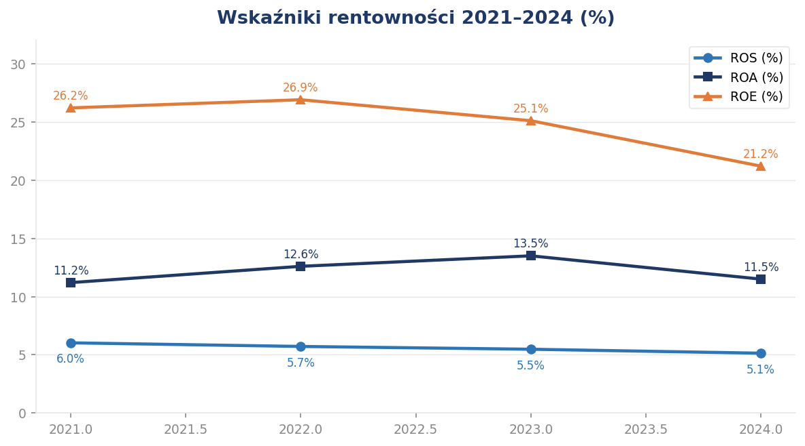
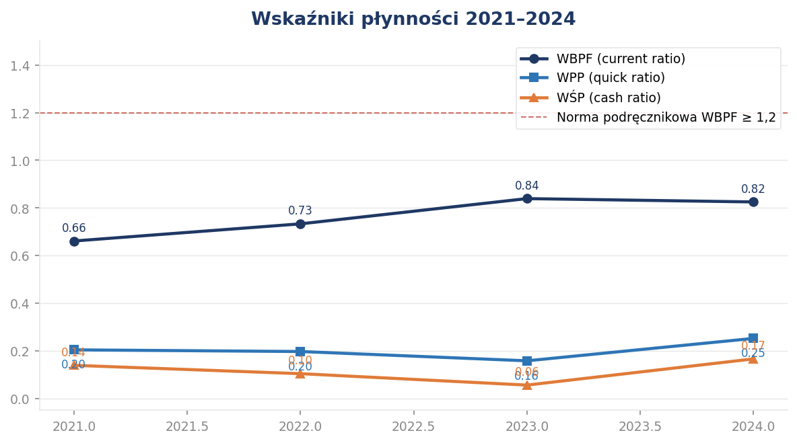
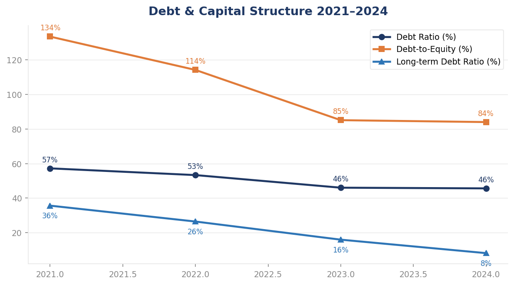
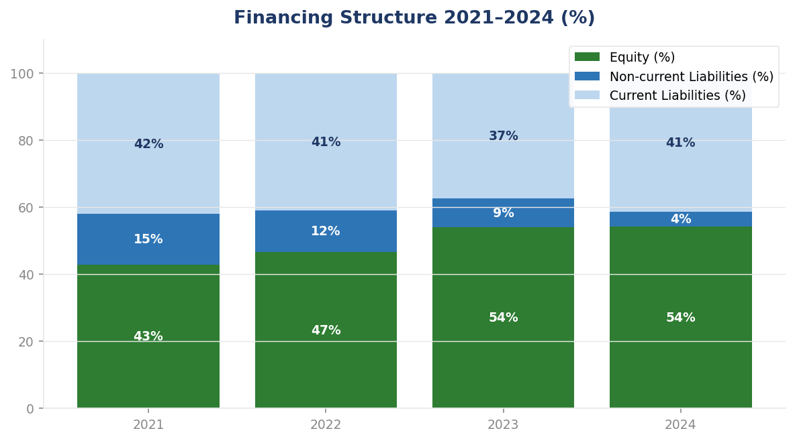

# 📊 Financial Statement Analysis — Dino Polska S.A. (2021–2024)

> **Comprehensive financial analysis of one of Poland's fastest-growing grocery retailers,**  
> covering profitability, liquidity, efficiency, capital structure, cash flow, and competitive positioning.

---


---

## 📋 Table of Contents

- [Project Overview](#project-overview)
- [Business Problem](#business-problem)
- [Objectives](#objectives)
- [Methodology](#methodology)
- [Data Sources](#data-sources)
- [Financial Ratios Analyzed](#financial-ratios-analyzed)
- [Key Charts & Visualizations](#key-charts--visualizations)
- [Business Insights](#business-insights)
- [Competitive Benchmarking](#competitive-benchmarking)
- [Recommendations](#recommendations)
- [Future Work](#future-work)
- [Project Structure](#project-structure)
- [Tools & Technologies](#tools--technologies)
- [About the Author](#about-the-author)

---

## 🏢 Project Overview

This project is a full-scope financial statement analysis of **Dino Polska S.A.** — one of Poland's fastest-growing mid-size grocery supermarket chains — covering the period **2021 to 2024**.

Dino Polska operates over **2,688 stores** (as of 2024), primarily in small and medium-sized towns, and is listed on the Warsaw Stock Exchange (GPW: DNP). The company follows a capital-light, owner-operated model built on vertical integration (own meat processing plant Agro-Rydzyna), proprietary real estate, and a standardized store format of approximately 400 m².

The analysis is based on **standalone (unconsolidated) financial statements** of Dino Polska S.A. and covers all major areas of financial analysis used in corporate FP&A and equity research:

| Area | Scope |
|---|---|
| Statements covered | Balance Sheet · P&L · Cash Flow Statement |
| Analysis methods | Horizontal · Vertical · Ratio · Trend · Benchmark |
| Period | 2021 · 2022 · 2023 · 2024 |
| Currency | Polish Złoty (PLN, thousands) |
| Standard | Polish Accounting Act (Ustawa o Rachunkowości) |

---

## ❓ Business Problem

Dino Polska has been one of the fastest-growing grocery retailers in Poland for several consecutive years. However, **rapid expansion always carries financial risk** — it can mask deteriorating margins, over-leverage the balance sheet, and strain liquidity.

This analysis was designed to answer three executive-level questions:

1. **Is the company financially healthy?**  
   → Can it sustain its expansion without compromising financial stability?

2. **What changed — and why?**  
   → Which financial metrics improved, which deteriorated, and what drove those changes?

3. **What should management do next?**  
   → What are the key risks, and what strategic actions should follow?

These are exactly the questions a CFO, FP&A Manager, or equity research analyst would ask when reviewing a company's financial performance.

---

## 🎯 Objectives

- Perform a complete financial statement analysis for the period 2021–2024
- Calculate and interpret all major financial ratios (profitability, liquidity, efficiency, debt)
- Conduct horizontal analysis (year-on-year changes) and vertical analysis (structure)
- Identify key trends and inflection points in the company's financial performance
- Benchmark Dino Polska against major competitors (Żabka Group, Biedronka / Jerónimo Martins)
- Identify business risks and opportunities based on financial data
- Formulate strategic recommendations supported by the analysis
- Present findings in a format suitable for executive management

---

## 🔬 Methodology

The analysis follows a structured, top-down approach, consistent with methods used in corporate FP&A departments and equity research:

```
Step 1 — Data Collection
        ↓
Step 2 — Data Cleaning & Structuring
        ↓
Step 3 — Horizontal Analysis (YoY changes in absolute and % terms)
        ↓
Step 4 — Vertical Analysis (structure: each item as % of total)
        ↓
Step 5 — Financial Ratio Calculation (20+ indicators)
        ↓
Step 6 — Trend Analysis (4-year trajectory for each metric)
        ↓
Step 7 — Competitive Benchmarking (Dino vs Żabka Group vs Biedronka)
        ↓
Step 8 — Business Interpretation (what the numbers mean operationally)
        ↓
Step 9 — Risk Assessment & Strategic Recommendations
```

All ratios are calculated from source financial data.  
Benchmark figures are based on publicly available annual reports of peer companies.  
No external databases or paid data providers were used.

---

## 📂 Data Sources

| Source | Description |
|---|---|
| Dino Polska S.A. Annual Reports (2021–2024) | Primary data — standalone financial statements |
| Żabka Group Annual Report 2024 | Competitive benchmark — revenue, ROS, store count |
| Jerónimo Martins Annual Report 2024 | Competitive benchmark — Biedronka revenue, EBIT margin, growth |
| Warsaw Stock Exchange (GPW) | Listed company profile and investor relations disclosures |
| Polish Financial Supervision Authority (KNF) | Regulatory filings |

> **Note:** All financial data used in this analysis is publicly available. No proprietary or confidential data was used.

---

## 📐 Financial Ratios Analyzed

### Profitability

| Ratio | Formula | 2021 | 2022 | 2023 | 2024 |
|---|---|---|---|---|---|
| ROS (Return on Sales) | Net Profit / Revenue | 6.0% | 6.1% | 6.0% | 5.1% |
| ROA (Return on Assets) | Net Profit / Total Assets | 11.2% | 12.5% | 13.5% | 11.5% |
| ROE (Return on Equity) | Net Profit / Equity | 26.2% | 26.9% | 25.1% | 21.2% |
| EBIT Margin | EBIT / Revenue | ~8.0% | ~8.0% | ~7.5% | ~6.5% |
| Operating Cost Ratio | Operating Costs / Revenue | ~92% | ~92% | ~92.5% | ~93% |

### Liquidity

| Ratio | Formula | 2021 | 2022 | 2023 | 2024 |
|---|---|---|---|---|---|
| Current Ratio (WBPF) | Current Assets / Current Liabilities | 0.66 | 0.72 | 0.71 | 0.82 |
| Quick Ratio (WPP) | (Current Assets – Inventory) / Current Liabilities | — | — | 0.16 | 0.25 |
| Cash Ratio (WŚP) | Cash / Current Liabilities | — | — | 0.06 | 0.17 |

> Liquidity ratios are below textbook benchmarks (CR > 1.2) — this is structurally normal for high-turnover grocery retail and reflects the negative working capital model deliberately used by Dino.

### Efficiency (Activity Ratios)

| Ratio | 2021 | 2022 | 2023 | 2024 |
|---|---|---|---|---|
| Total Asset Turnover | 1.86 | 2.05 | 2.47 | 2.24 |
| Fixed Asset Turnover | — | — | 3.60 | — |
| Days Inventory Outstanding (DIO) | ~37 days | ~37 days | ~37 days | ~37 days |
| Days Payable Outstanding (DPO) | — | — | — | ~54 days |
| Cash Conversion Cycle (CCC) | — | — | — | **–11 days** |

> **A negative CCC of –11 days** means Dino collects cash from customers before it pays its suppliers — essentially financing operations with free trade credit. This is a significant structural advantage.

### Debt & Capital Structure

| Ratio | Formula | 2021 | 2022 | 2023 | 2024 |
|---|---|---|---|---|---|
| Debt Ratio | Total Liabilities / Total Assets | 57% | — | — | **46%** |
| Debt-to-Equity | Total Liabilities / Equity | 133% | — | — | **84%** |
| Long-term Debt Ratio | LT Liabilities / Equity | 36% | — | — | **8%** |

---

## 📈 Key Charts & Visualizations

### Revenue Growth 2021–2024


Revenue grew from PLN 13,362M in 2021 to PLN 29,274M in 2024 — a **CAGR of 29.8%**, the highest among analyzed competitors. The company added 873 net new stores over the period (+48%).

---

### Profitability Ratios 2021–2024


ROA peaked at 13.5% in 2023 and pulled back to 11.5% in 2024 — not due to weaker results, but because total assets grew +26% year-on-year following record capex. ROE declined from 26.9% to 21.2%, driven by a larger equity base (retained earnings), not weaker profitability.

---

### Liquidity Ratios 2021–2024


All three liquidity ratios are below standard academic benchmarks but improved in 2024. The Current Ratio of 0.82 is consistent with the negative working capital model typical of large grocery retailers operating on supplier trade credit.

---

### Debt Structure 2021–2024


The Debt Ratio declined from 57% to 46%, while equity financing increased from 43% to 54% of total assets — a direct result of the no-dividend policy and full earnings retention since 2021.

---

### Operating Cash Flow 2021–2024


Operating cash flow reached a record PLN 2,557M in 2024, fully covering PLN 1,597M in investment expenditure (capex + acquisition of 75% stake in eZebra.pl — Dino's first e-commerce venture).

---

### Balance Sheet Structure 2021–2024


The share of equity in total financing grew from 43% to 54% over the period. Non-current liabilities (long-term bank loans, bonds) declined significantly, while current liabilities (primarily trade payables) remained the dominant source of external financing — consistent with the trade credit model.

---

### Competitive Benchmarking


| Metric | Dino Polska | Żabka Group | Biedronka (JM) |
|---|---|---|---|
| Revenue CAGR 2021–2024 | **29.8%** | 23.9% | 15.1% |
| ROS 2024 | **5.1%** | 2.49% | ~5.0% |
| Revenue per Store Growth (CAGR) | **13.9%** | — | — |
| Like-for-like Growth 2024 | **+5.3%** | — | — |

> Dino's ROS of 5.1% significantly outperforms Żabka Group (2.49%), suggesting that the owner-operated model converts scale into profit more efficiently than the franchise model.

---

## 💡 Business Insights

### 1. The fastest-growing major grocery chain in Poland

Dino achieved the highest revenue CAGR (29.8%) among analyzed competitors, driven by both new store openings and improving productivity of the existing network. Revenue per store grew at 13.9% annually — meaning growth is not purely driven by physical expansion.

### 2. Margin pressure is the only visible warning signal

ROS declined from 6.0% to 5.1% (–15% in relative terms) over the period, primarily due to rising labor and energy costs in 2023–2024. All other financial metrics either improved or remained stable. This single trend requires monitoring but does not indicate structural deterioration.

### 3. Negative working capital is a feature, not a bug

The negative Cash Conversion Cycle of –11 days and Working Capital of –PLN 961M are intentional consequences of Dino's operating model: the company collects cash at the point of sale while paying suppliers 54 days later. This effectively means suppliers finance a portion of Dino's operations at zero cost.

### 4. The balance sheet is getting stronger every year

Equity financing grew from 43% to 54% of assets. Long-term debt declined from 36% to 8% of equity. This improvement is entirely self-funded through retained earnings — the company has maintained a zero-dividend policy throughout the period.

### 5. Record operating cash flow covers all investment needs

PLN 2,557M in operating cash flow (2024) covered PLN 1,597M in capex and the acquisition of a controlling stake in eZebra.pl — the company's first move into e-commerce.

---

## 🏆 Competitive Benchmarking

Dino Polska was benchmarked against two major competitors in the Polish grocery market:

**Żabka Group** — the dominant convenience store network in Poland (~9,900 stores, franchise model, Q-commerce focus)  
**Biedronka (Jerónimo Martins)** — the largest grocery discount chain in Poland by revenue and store count

Key conclusions from the benchmark:
- Dino's revenue growth rate significantly outpaces both competitors
- Dino's ROS (5.1%) is more than twice Żabka Group's (2.49%), suggesting superior unit economics
- Revenue per store growing faster than competitors indicates improving like-for-like performance, not just physical expansion

> **Data limitation:** Benchmark figures are based on publicly available annual reports. Żabka Group and Biedronka operate under different accounting standards (IFRS vs Polish GAAP) and use different business models (franchise vs owned), which limits direct comparability. This is acknowledged throughout the analysis.

---

## 📌 Recommendations

Based on the financial analysis, five strategic recommendations were identified:

**1. Monitor unit-level cost efficiency**  
Track labor and energy costs per store to identify which locations are driving ROS erosion before it becomes systemic.

**2. Maintain supplier relationship discipline**  
The negative CCC depends on maintaining favorable payment terms with suppliers. Any tightening of trade credit terms would require alternative financing.

**3. Continue the retained earnings policy**  
The no-dividend policy has been the primary driver of balance sheet improvement. Continuing it through the current expansion phase is financially rational.

**4. Track e-commerce profitability before scaling**  
The eZebra.pl acquisition is an early-stage strategic experiment. Profitability and integration costs should be monitored before the e-commerce channel receives further capital allocation.

**5. Use improving creditworthiness selectively**  
The declining Debt Ratio (46%) and growing equity base have improved Dino's credit profile. This capacity could be used selectively for acquisitions with high expected returns, without compromising the conservative financing model.

---

## 🔮 Future Work

| Area | Description |
|---|---|
| Power BI Dashboard | 3-page executive dashboard — Executive View · Statement Analysis · Business Insights — currently in development |
| Consolidated analysis | Expand to consolidated group statements to include Agro-Rydzyna and eZebra.pl |
| 2025 update | Add 2025 financial statements when published to extend the trend analysis |
| DCF valuation | Develop a simple discounted cash flow model based on projected free cash flow |
| Sensitivity analysis | Model the impact of labor cost growth scenarios on ROS and net profit |
| Sector comparison | Expand competitive benchmarking to include Lidl Poland and Aldi Poland if data becomes available |

---

## 📁 Project Structure

```
Financial-Analysis-Dino-Polska-SA/
│
├── README.md
├── LICENSE
│
├── data/
│   ├── raw/
│   │   └── Dino_Polska_Sprawozdania_2021_2024.xlsx
│   └── processed/
│       └── Dino_Polska_Ratios_Calculated.xlsx
│
├── report/
│   ├── Dino_Polska_Raport_Analityczny.docx
│   └── Dino_Polska_Raport_Wykonawczy.docx
│
├── images/
│   ├── charts/
│   │   ├── 01_revenue_trend.png
│   │   ├── 02_profitability_ratios.png
│   │   ├── 03_liquidity_ratios.png
│   │   ├── 04_debt_ratios.png
│   │   ├── 05_cashflow_waterfall.png
│   │   ├── 06_balance_sheet_structure.png
│   │   └── 07_competitive_benchmarking.png
│   └── cover.png
│
└── notebooks/
    └── Dino_Polska_Analysis.ipynb
```

---

## 🛠 Tools & Technologies

| Tool | Purpose |
|---|---|
| Microsoft Excel | Data structuring, ratio calculation, horizontal & vertical analysis |
| Microsoft Word | Full analytical report and executive summary |
| Power BI Desktop | Executive dashboard (in development) |
| Python (pandas, matplotlib) | Data processing and chart generation *(optional)* |
| GitHub | Version control and portfolio presentation |

---

## 👩‍💼 About the Author

**Daryna**  
Finance & Accounting student · Business Process Automation specialization  
WSZiB (Wyższa Szkoła Zarządzania i Bankowości), Kraków

Currently seeking roles in: **Junior Financial Analyst · Business Analyst · FP&A · Data Analyst**

**Certifications & Projects:**
- IBM Data Analyst Professional Certificate
- Power BI certification (Santander Open Academy)
- UiPath Automation Developer Associate
- AI & Labor Market Analysis (Python, Pearson correlation, 666 occupations)
- AP Invoice Automation (Python + n8n + Google Workspace)

📍 Kraków, Poland · Available for hybrid and remote roles

---

## 📄 License

This project is licensed under the **MIT License** — see the [LICENSE](LICENSE) file for details.

You are free to use this project as a reference for educational purposes. If you reference this work, please credit the author.

---

*Last updated: June 2026*

